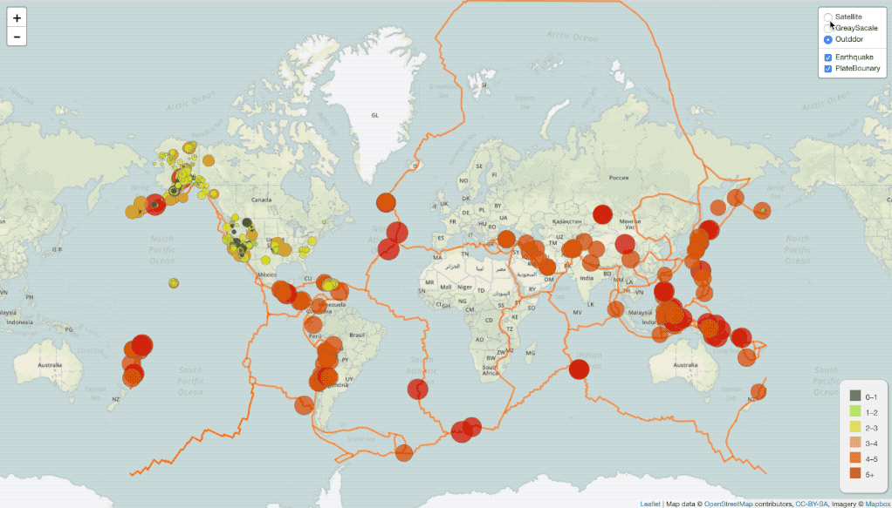

# Leaflet - Visualizing Data with Leaflet

## Visaulizing the relationship between **earthquake** and **tectonic plate boundary**

Welcome to the United States Geological Survey, or USGS for short! The USGS is responsible for providing scientific data about natural hazards, the health of our ecosystems and environment; and the impacts of climate and land-use change. 

In this work, a new set of tools will be built to visualize the earthquake data in the past week(with update every 5 min!). 

### Before You Begin

## The Task

### 1. Basic Visualization

Let's try to visualize an earthquake data set first.

1. **Get the data set**

   

   The USGS provides earthquake data in a number of different formats, updated every 5 minutes. Visit the [USGS GeoJSON Feed](http://earthquake.usgs.gov/earthquakes/feed/v1.0/geojson.php) page for more info. 

2. **Import & Visualize the Data**

   Create a map using Leaflet that plots all of the earthquakes from the data set based on their longitude and latitude.

   * Data markers reflect the **magnitude** of the earthquake in their `size` and `color`. Earthquakes with higher magnitudes should appear larger and darker in color.

   * Include popups that provide additional information about the earthquake when a marker is clicked.

   * Create a legend that provides context for the earthquake magnitude data.

- - -

### 2. Interactive Data Visualization

Looking good! Let's illustrate the relationship between tectonic plates and seismic activity! 
A second data set on tectonic plates is obtained at <https://github.com/fraxen/tectonicplates>.

In this step..

* Plot the plate boundary data set on the previous map.

* Add other base maps (Satellite, Outdoors, etc) to choose from as well as separate out the two different data sets into overlays that can be turned on and off independently.

* Add layer controls to our map.
