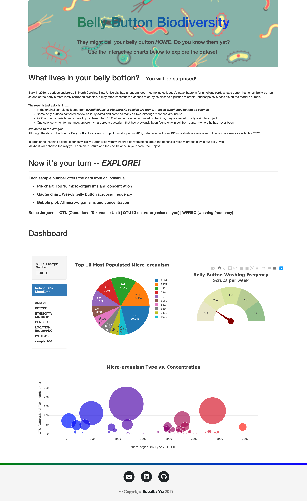
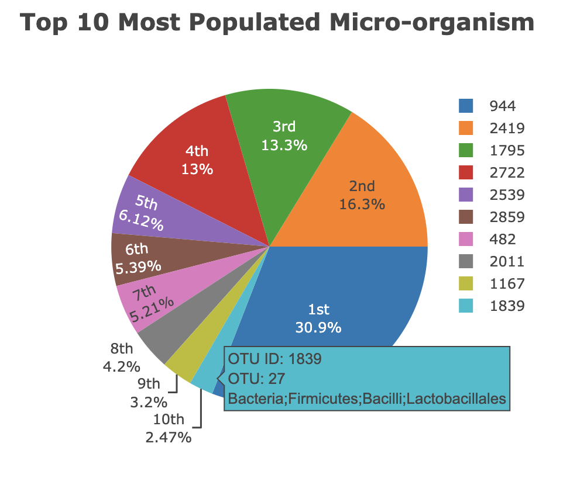
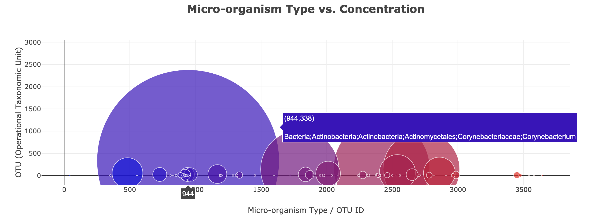
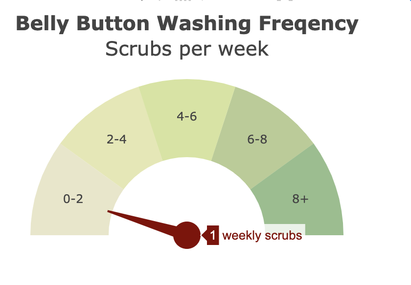

# Belly Button Biodiversity

In this work, an interactive dashboard will be built to explore the [Belly Button Biodiversity DataSet](http://robdunnlab.com/projects/belly-button-biodiversity/).

### Do you know what lives in your belly button? 

## 1 - Plotly.js

Use `Plotly.js` to build interactive charts for the dashboard.

* Create a `PIE chart` that uses data from samples route (`/samples/<sample>`) to display the top 10 samples.

  * Use `sample_values` as the values for the PIE chart.

  * Use `otu_ids` as the labels for the pie chart.

  * Use `otu_labels` as the hovertext for the chart.

  

* Create a `Bubble Chart` that uses data from samples route (`/samples/<sample>`) to display each sample.

  * Use `sample_values` for the marker size.

  * Use `otu_labels` for the text values.

  

* Display the sample metadata from the route `/metadata/<sample>`

  * Display each key/value pair from the metadata JSON object somewhere on the page.
  
* Adapt the `Gauge Chart` to plot the Weekly Washing Frequency obtained from the `/metadata/<sample>`route.
  

* Update all of the plots any time that a new sample is selected.

## 2 - Heroku

Deploy the Flask app to Heroku.

* You can use the provided sqlite file for the database.

- - -

## Flask API

Use Flask API starter code to serve the data needed for your plots.

* Test your routes by visiting each one in the browser.

